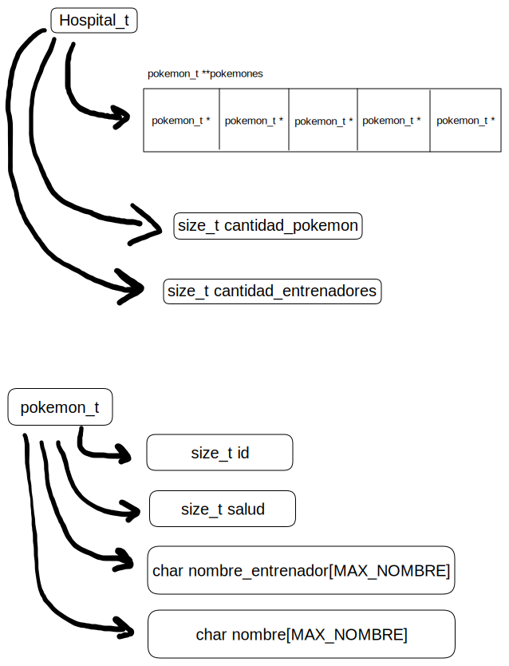

<div align="right">

</div>

# TP1

## Repositorio de Valentin Calomin0 - 109665 - vcalomino@fi.uba.ar

- Para compilar:

```bash
gcc src/*.c pruebas_chanutron.c -std=c99 -Wall -Wconversion -Wtype-limits -pedantic -Werror -O2 -g -o pruebas_chanutron
```

- Para ejecutar:

```bash
./pruebas_chanutron
```

- Para ejecutar con valgrind:
```bash
valgrind --leak-check=full --track-origins=yes --show-reachable=yes --error-exitcode=2 --show-leak-kinds=all --trace-children=yes ./pruebas_chanutron
```
---
##  Funcionamiento

El programa cuenta con dos estructuras principales: hospital_t y pokemon_t.



Para crear estas estructuras se lee un archivo linea por linea que cuenta con un formato especifico (id,nombre,salud,entrenador) y se crea un pokemon que se agrega al hospital.


Como utilice la funcion "fgets", para validar que el archivo no este vacio, primero chequeo que lo que devuelve no sea null:

```c
if (fgets(linea, LONGITUD_LINEA, f) == NULL) {
		free(hospital);
		fclose(f);
		return NULL;
	}
```
y lo utilizo para crear un pokemon y luego, una vez que se que el archivo no esta vacio, utilizo fgets en un while:

```c
while (fgets(linea, LONGITUD_LINEA, f))
```

Para realizar el realloc mencionado en el diagrama se utiliza:

```c
hospital->pokemones = realloc(hospital->pokemones, sizeof(pokemon_t *) * (hospital->cantidad_pokemon + 1));
```

(Aclaracion: a la hora de crear el hospital cada linea se guarda en una variable "char linea[LONGITUD_LINEA];" siendo esta longitud la maxima sugerida por el enunciado.)
(Aclaracion 2: la variable size_t cantidad_entrenadores que se encuentra en hospital_t la implemente asumiendo que con cada pokemon se agrega un entrenador, de igual manera no influia en el desarrollo de las pruebas.)

Tambien, implemente una funcion que compara la salud de un pokemon con el siguiente en el vector y si el orden es incorrecto los intercambia. Esto termina con un vector de pokemones ordenados por salud siendo el de la posicion "0" el de menor salud.

---